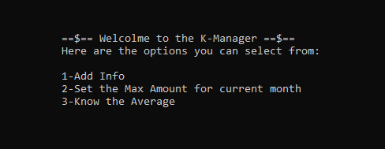
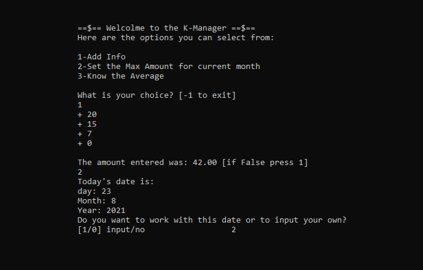

# CNote

Application that helps keep track of expenses each day, by inputting the amounts spent to have an organized list of expenses.

## How to run

To get started you can `git clone  https://github.com/DYasser/CNote.git` and have `C++` installed and initialized. You can run the file then by running the main class using an IDE.

## Coding process

I wanted to create an app that would allow the user to set up a maximum amount to spend each month and have him/her enter the expenses to be on track of how to spend money.

I first created variables to hold the important variables such as `MAX` for the maximum value to spend on a month. I stored that value in a text file to have it always saved.

```C++
FMAX.open("MAX.txt");   // get value of
FMAX >> MAX;            // MAX and put it
FMAX.close();           // in the vector
```

After that, I created a text file to store all the amount spent before in each month. So, when I start the app the program already knows how much was already spent in the month.

```C++
Amount.open("Amount.txt", std::fstream::out | std::fstream::in | std::fstream::app);
Amount >> floatValue;
VAMOUNTS.push_back(floatValue);
while(getline(Amount, fileLine))
{
    amountUsed += floatValue;
    Amount >> floatValue;
    VAMOUNTS.push_back(floatValue);
}
Amount.close();
```

I also made the program to get the time so that the user doesn't have to input it manually unless he wants to input a different date than the current one for him/her. This feature was created to avoid bugs like when an user forgets to input the expenses of one day.

```C++
//Getting the time
time_t now = time(0);
tm *Ltm = localtime(&now);
int cYear = 1900 + Ltm->tm_year;
int cDay = Ltm->tm_mday;
int cMonth = 1 + Ltm->tm_mon;
```

After setting up all the data needed, the main menu appears in front of the user prompting him/her to choose an action.



The third option helps the user know how much he spent so far and shows the maximum amount to spend then makes an average of how much needs to be spent everyday to reach the maximum.

The second option is used to set a maximum amount to spend each month.

And finally the first option the most interesting one. It allows the user to input how much he spent and make a sum of it then select a date and confirm.



I coded this program to level up my knowledge using `C++` in a project but also to help me see how much money I should be spending every day as a student, which helps a lot to stay on track.

>     This is the end of my documentation.
